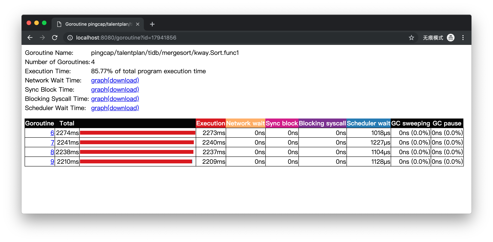
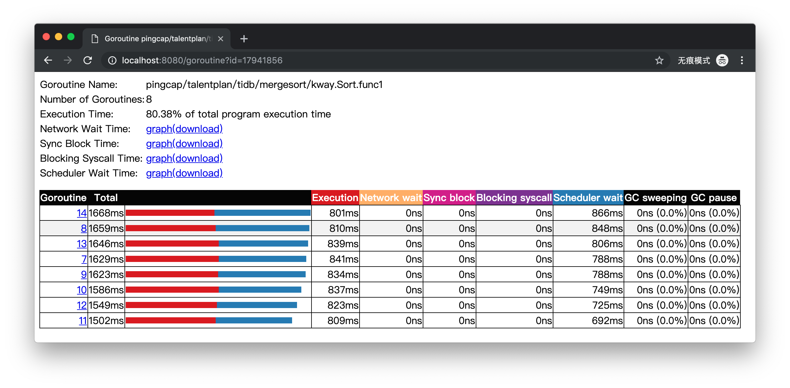

# Understanding

为了实现一个性能超过`sort.Slice()`函数的归并排序算法，我们需要利用多核CPU，实现一个并行归并排序。对于每个并行的部分，我们可以直接利用`sort.Slice()`进行排序。对于归并的部分，我们需要实现一个归并算法。由于不同的机器的CPU核心数可能不同，我们需要实现一个多路归并排序算法。可参考[Wikipedia的介绍][k-way-merge]进行实现。

# Design

要编写一个充分利用每一个CPU核心的并行排序算法，我们需要让每个goroutine并行地运行在每一个操作系统线程上。因此，需要创建数量为`runtime.NumCPU()`的goroutine进行分段并行排序。最后，通过同步操作在所有“排序goroutine”运行结束后，将所有的部分有序的数组进行多路归并，得出最后完整排序好的数组。

# Build

为了充分利用多核CPU，`kway.Sort()`函数创建了`n`个goroutine，其中`n`等于`runtime.NumCPU()`，也就是CPU核心的个数。通过查看trace的goroutine analysis，我们可以看到当`n`等于`runtime.NumCPU()`时，每个goroutine的运行时间几乎全部都是在运行（Execution）状态。


当我们修改代码使`n`等于两倍的`runtime.NumCPU()`时，
```diff
diff --git a/tidb/mergesort/kway/merge.go b/tidb/mergesort/kway/merge.go
index f173e9b..fa57183 100644
--- a/tidb/mergesort/kway/merge.go
+++ b/tidb/mergesort/kway/merge.go
@@ -10,7 +10,7 @@ import (
 // Sort sorts the array with multiple goroutines using K-way Merge Sort algorithm.
 func Sort(data []int64) {
        var (
-               n = runtime.NumCPU()
+               n = 2 * runtime.NumCPU()
        )

        if len(data) < 10*n {
```

每个goroutine的运行时间会有几乎一半用于等待调度（Schedular wait）状态。


在实现goroutine同步部分，`kway.Sort()`使用`sync.WaitGroup`来在排序goroutine与多路归并goroutine之间进行同步。

在实现多路归并算法部分，`kway.Sort()`使用[Tournament Tree算法][tournament]。Tournamenet Tree算法中，维护一个loser tree，其底层使用一维数组实现，与堆的底层存储方式类似。

`Tournament`是Tournament Tree算法运行中主要维护的一个结构体，其包含了树的底层一维数组、树的大小和所有部分排序数组的slice。`NewTournament()`用于构造一个`Tournament`。它会将每个人数组的第一个元素放到叶子结点上，并完成最初的loser tree的构建。`Tournament.Winner()`返回当前的winner。`Tournament.Replace`根据winner的索引，替换下一个数组元素到loser tree中，并针对此新元素运行一次`promote`，计算出新的winner。由于loser tree上已经把需要和新元素进行"决斗"的元素（也就是每一个之前败下阵来的loser）存储在了通往根结点的路径上，`promote`只需要往根结点进行回溯，并依次进行"决斗"，就能计算出新的winner。

# Benchmark

第一次实现，`make bench`结果已经比`sort.Slice()`好。
```
$ benchcmp normal.bench merge.bench
benchmark                old ns/op      new ns/op      delta
BenchmarkMergeSort-4     4571118431     2331650872     -48.99%
BenchmarkMergeSort-4     4886610935     2198418573     -55.01%
BenchmarkMergeSort-4     4137878964     2270982706     -45.12%
BenchmarkMergeSort-4     4196225261     2202097650     -47.52%

benchmark                old allocs     new allocs     delta
BenchmarkMergeSort-4     2              17             +750.00%
BenchmarkMergeSort-4     2              14             +600.00%
BenchmarkMergeSort-4     2              17             +750.00%
BenchmarkMergeSort-4     2              12             +500.00%

benchmark                old bytes     new bytes     delta
BenchmarkMergeSort-4     64            134219904     +209718500.00%
BenchmarkMergeSort-4     64            134219040     +209717150.00%
BenchmarkMergeSort-4     64            134220064     +209718750.00%
BenchmarkMergeSort-4     64            134218272     +209715950.00%
```

根据`go tool pprof _pprof/v0/cpu.out`显示结果分析，算法主要瓶颈在`sort.Slice()`上。

```
(pprof) top
Showing nodes accounting for 6480ms, 98.93% of 6550ms total
Dropped 22 nodes (cum <= 32.75ms)
Showing top 10 nodes out of 17
      flat  flat%   sum%        cum   cum%
    3320ms 50.69% 50.69%     4270ms 65.19%  sort.doPivot
     620ms  9.47% 60.15%      640ms  9.77%  pingcap/talentplan/tidb/mergesort/kway.Merge
     610ms  9.31% 69.47%      610ms  9.31%  pingcap/talentplan/tidb/mergesort/kway.Int64Slice.Less
     510ms  7.79% 77.25%      510ms  7.79%  pingcap/talentplan/tidb/mergesort.prepare
     440ms  6.72% 83.97%      440ms  6.72%  runtime.newstack
     300ms  4.58% 88.55%      300ms  4.58%  pingcap/talentplan/tidb/mergesort/kway.Int64Slice.Swap
     300ms  4.58% 93.13%      410ms  6.26%  sort.insertionSort
     150ms  2.29% 95.42%      150ms  2.29%  runtime.memmove
     130ms  1.98% 97.40%     5200ms 79.39%  sort.quickSort
     100ms  1.53% 98.93%      150ms  2.29%  sort.medianOfThree
```


[k-way-merge]: https://en.wikipedia.org/wiki/K-way_merge_algorithm
[tournament]: https://en.wikipedia.org/wiki/K-way_merge_algorithm#Tournament_Tree
